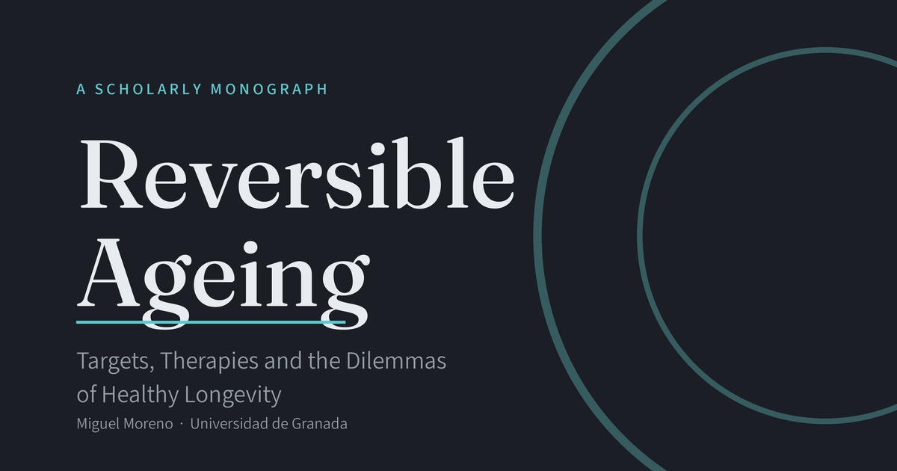

# Reversible Ageing

[](https://doi.org/10.5281/zenodo.20745513)
[](https://creativecommons.org/licenses/by-nc-sa/4.0/)
[](https://utilizas.github.io/ageing/)

### Targets, Therapies and the Dilemmas of Healthy Longevity

**Miguel Moreno** · University of Granada

A scholarly monograph on the cellular and molecular mechanisms of ageing, current rejuvenation strategies, and their clinical, societal and philosophical implications. Roughly seventy per cent of the text concerns the biology and medicine of ageing; the remainder examines the demographic, economic, ethical and philosophical stakes of technologies capable of reshaping the human lifespan.

## Read online

[](https://utilizas.github.io/ageing/)

- Canonical version: **[utilizas.github.io/ageing](https://utilizas.github.io/ageing/)** 

The book is also mirrored, with identical content, on the following platforms:

- [ageing-omega.vercel.app](https://ageing-omega.vercel.app/)
- [agei.netlify.app](https://agei.netlify.app/)
- [ageing.utilizas.workers.dev](https://ageing.utilizas.workers.dev/)

These mirrors exist for redundancy and platform comparison, since occasional slow loading or temporary downtime on any one platform is not unusual for a project of this size and complexity. The GitHub Pages edition above is the one to cite or link to, and the one all mirrors point back to via their canonical metadata.

## About this work

The text is organised into five parts moving from biological mechanism to medicine to society: the biology of ageing, mechanisms and molecular targets, therapeutic strategies, the path from bench to bedside, and the demographic, economic, ethical and philosophical dimensions of intervening in human ageing. A full account of how the book is organised, and of the conventions used throughout — callout boxes, collapsible technical asides, runnable simulation code — is given in the [Preface](https://utilizas.github.io/ageing/) and [Introduction](https://utilizas.github.io/ageing/intro.html).

Citations are concentrated in the most recent decade and weighted towards *Cell*, *Nature* and their specialist journals, *Science*, and the major review series; every reference has been checked against its primary record. Where evidence is preliminary, contested, or confined to model organisms, the text says so rather than rounding up to certainty.

## Source and format

The book is written in [Quarto](https://quarto.org) and produced with R/RStudio; figures are generated from code included in the source itself (folded by default — `code-fold: true` — so the underlying computation can be inspected or re-run rather than taken on faith), and the bibliography is maintained as a single `references.bib` file rather than scattered across chapter-end reference lists.

HTML was chosen as the only output format, deliberately, rather than a parallel PDF or Word edition. The apparatus the text relies on — collapsible technical asides, runnable simulation boxes, full-text search, a glossary and list of abbreviations cross-referenced from every chapter, a light and a dark reading mode — depends on the page being a living document; little of it survives translation to a paginated format. Accessibility weighed as heavily as interactivity in that choice: semantic HTML is read correctly by screen readers in a way that PDF, with its fixed page geometry and often broken tagging, generally is not; text reflows to whatever size, line spacing or device a reader needs, rather than being locked to the dimensions of a printed page; and any modern browser can translate the page on demand, putting the book within reach of a reader in a language other than English — even though a machine translation, unlike the source text, cannot be expected to handle technical and scientific terminology with the same care. The format follows from what the text, and its readers, need it to do, not from convention.

This repository is shared for transparency and citability rather than as an open collaborative-editing project. The manuscript is authored and maintained by Miguel Moreno, with Claude (Anthropic) used as a drafting and research-verification aid, as described in the Preface.


## Citing this work

> Moreno-Muñoz, M. (2026). *Reversible Ageing: Targets, Therapies and the Dilemmas of Healthy Longevity*. Zenodo. https://doi.org/10.5281/zenodo.20745513

```bibtex
@book{moreno2026rev,
  author    = {Moreno, Miguel},
  title     = {Reversible Ageing: Targets, Therapies and the Dilemmas of Healthy Longevity},
  year      = {2026},
  month     = jun,
  publisher = {Zenodo},
  doi       = {10.5281/zenodo.20745513},
  url       = {https://doi.org/10.5281/zenodo.20745513}
}
```

## Licence

This work is licensed under a [Creative Commons Attribution-NonCommercial-ShareAlike 4.0 International licence](https://creativecommons.org/licenses/by-nc-sa/4.0/).

## Contact

Miguel Moreno — University of Granada — [ORCID](https://orcid.org/0000-0002-0746-9587)
